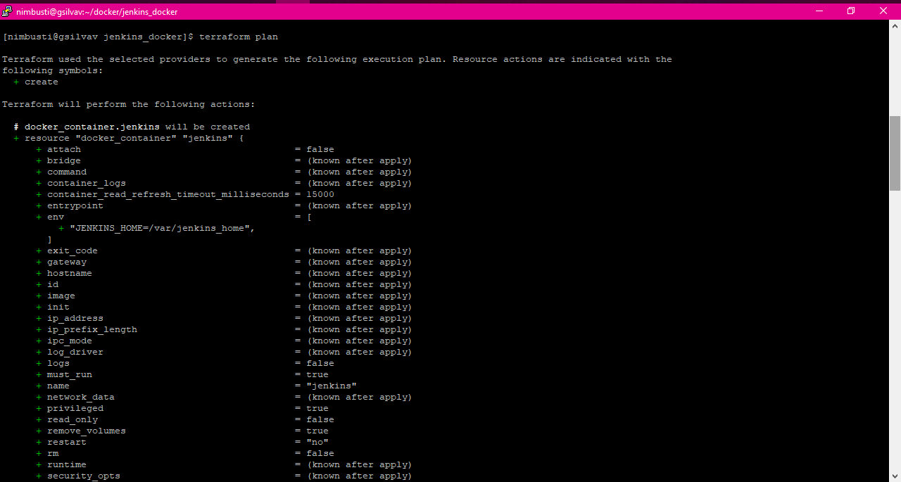
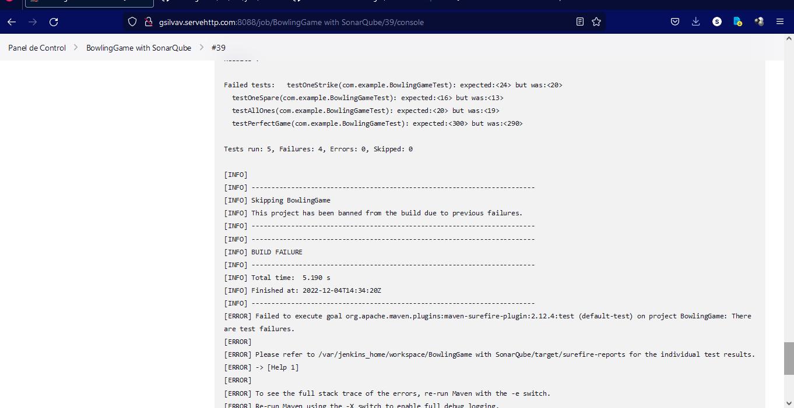
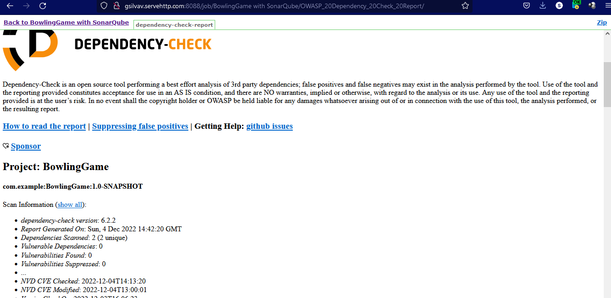

# Checkpoint Proyecto Final Sesión 01 - Desarrollo de software ágil

Rúbrica entrega de tareas:

<https://github.com/GabrielSilvaMx/HSBC-BEDU-Developer-Engineering/tree/main/Modulo%201>

## **Rúbrica Checkpoint - Proyecto Final**

Video de entrega del Checkpoint:

<https://youtu.be/NzNpYxqptZE>

**1) Proyecto prácticas ágiles**

El proyecto se encuentra en la carpeta de entregable en la Sesión 01:

<https://github.com/GabrielSilvaMx/HSBC-BEDU-Developer-Engineering/tree/main/Modulo%201/Sesi%C3%B3n%201>

**2) Objetivos**

-   Crear infraestructura con Terraform
-   Crear Pipelines en Jenkins
-   Instalar y configurar un SonarQube.
-   Conectar el SonarQube con Jenkins.
-   Escaneo vulnerabilidades OWASP Zap con Jenkins.

## Generación de plantilla de infraestructura a través de Terraform

Con el uso de Terraform construiremos una imágen, la almacenaremos en el servidor en la nube y montaremos un contenedor MySQL, Jenkins y SonarQube para luego probar su funcionamiento y revisar el log del contenedor.

El primer paso es inicializar el directorio de trabajo que contiene archivos de configuración de Terraform. Este es el primer comando que debe ejecutarse después de escribir una nueva configuración de Terraform o clonar una existente desde el control de versiones.

El **terraform validate** valida los archivos de configuración en un directorio, refiriéndose solo a la configuración y sin acceder a ningún servicio remoto, como el estado remoto, las API del proveedor, etc.

El **terraform plan** crea un plan de ejecución, que le permite obtener una vista previa de los cambios que Terraform planea realizar en su infraestructura.

Se generaron varios archivos tf los cuales van a crear

El terraform apply ejecuta las acciones propuestas en un plan Terraform.

Cuando estemos seguros de aplicarlo, escribimos “**yes**” y la tecla *Enter* para ejecutarlo:

## Construcción de imagen de Docker

Los contenedores se crean y nos muestra las IP de Jenkins y MySQL.

Ejecutamos el comando **docker ps -a** para revisar que estén arriba los servicios ya en ejecución:

## Pipeline de despliegue automático

Posteriormente ingresamos al navegador web y revisamos que es posible loguearse al servidor de Jenkins y de SonarQube:

Al ingresar a Jenkins, se generó un Pipeline llamado “BowlingGame with SonarQube”.

Este Pipeline se configuró para que el Trigger se dispare de manera automática cada vez que haya un cambio en la rama Master del reposiorio de GitHub. Mas adelante veremos cómo al hacer un cambio en la rama Master el Pipeline automáticamente realiza la ejecución de manera automática.

Así también, se configuró un archivo JenkinsFile dentro de este repositorio para automatizar las pruebas del proyecto.

| Archivo JenkinsFile: | <https://github.com/GabrielSilvaMx/BowlingGame/blob/master/Jenkinsfile> |
|----------------------|-------------------------------------------------------------------------|

El repositorio para llevar a cabo las pruebas se encuentra en la siguiente dirección:

<https://github.com/GabrielSilvaMx/BowlingGame>

El repositorio contiene un proyecto sencillo en Java donde se utilizó parte de una Kata llamada “Bowling Game”.

| Información de la Kata | <https://github.com/scturkey/bowling-game-kata>                                       |
|------------------------|---------------------------------------------------------------------------------------|
| Archivos de pruebas    | <https://github.com/GabrielSilvaMx/BowlingGame/tree/master/src/test/java/com/example> |

## Pruebas de código estático

Antes de ejecutar el PipeLine realizamos las pruebas del código para verificar que efectivamente el código está funcionando correctamente. Para ello, en IntellIj Idea efectuamos las pruebas del código:

Observamos que todas las pruebas están correctas y se sube a la rama Master del repositorio los cambios del proyecto.

Una vez configurado nuestro PipeLine lo ejecutamos con la opción “Construir ahora”

Observamos que el Pipeline empieza a realizar las tareas realizadas a través del escenario propuesto mediante el archivo de JenkinsFile.

Podemos ingresar a la tarea para observar la salida en tiempo de ejecución.

Observamos que está llevando a cabo los pasos indicados:

Una vez finalizada la ejecución nos mostrará la leyenda: “**Finished: SUCCESS**”

Volvemos al PipeLine y revisamos que efectivamente terminó con éxito el escenario:

## Ejecución del pipeline

El siguiente paso es verificar cuando las pruebas no se ejecutan correctamente.

En IntelliJ Idea modificamos el código para que las pruebas no pasen correctamente, por lo que vamos a simular que la máquina de bolos se descompuso y por lo tanto las pruebas no son válidas.

En la siguiente pantalla observamos que se hizo un cambio a la línea 8 del archivo BowlingGame.java cambiando el valor de la variable privada de 0 a 1. Al ejecutar las pruebas observamos que se envía el error:

Pero supongamos que el programador sube este código al repositorio

Una vez que le aprueban sus cambios en el repositorio, el Pipeline automáticamente empezará a realizar la siguiente tarea de validación:

Se observa que ya no pasó uno de los escenarios y si nos dirigimos a los logs de esta tarea se verifica que fue debido a que los tests no pasaron correctamente:

## Despliegue

El programador verifica y hace ajustes al código por lo que arregla la línea de código, ejecuta las pruebas y vuelve a subir los cambios al repositorio en GitHub.

Se observa en el repositorio de GitHub que se actualizó la rama master:

Observamos que nuevamente el Pipeline en Jenkins se vuelve a ejecutar ya que hubo un cambio en la rama Master:

Y nuevamente, verificamos que todos los escenarios se ejecutaron correctamente

## Pruebas de código dinámico

Siguiente, escaneamos las vulnerabilidades encontradas con OWASP Zap y generamos el reporte por parte de Jenkins:

## Aprobaciones para después del despliegue

Posteriormente, ingresamos al reporte generado por SonarQube. Nos mostrará los problemas encontrados (issues) desde el más grave hasta el más bajo con un detalle del problema y cómo resolverlo:

Por último, en nuestra consola ejecutamos el comando terraform destroy, escribimos “**yes**” y la tecla *Enter* para confirmar:

Nuestros contenedores creados serán eliminados con éxito.
