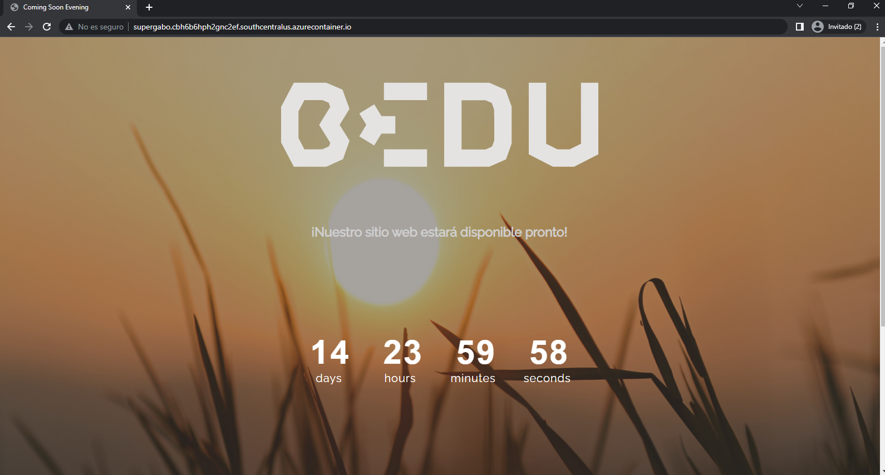

# Módulo 1 - Sesión 4 "Fundamentos de DevSecOps" PostWork

Con base en la aplicación que has ido desarrollando a lo largo del módulo crearás imágenes Docker y podrás lograr versionar las mismas, tomando en cuenta las siguientes indicaciones:

Deberás descargar y manipular imágenes Docker.
Versionar las imágenes creadas.
 
Utilizar línea de comandos para comprender la Infraestructura.
 

| Carpeta  | Descripción                                                                                                                                                                                                                                                                                                                                                                                                                                                                                                                                                                                             |
|--------------------------|-----------------------------------------------------------------------------------------------------------------------------------------------------------------------------------------------------------------------------------------------------------------------------------------------------------------------------------------------------------------------------------------------------------------------------------------------------------------------------------------------------------------------------------------------------------------------------------------------------------|
| PostWork         | Documento en Word con las evidencias del PostWork  Imagen con Docker levantado en Azure.|

Resultado Final: 
Desplegar un servidor de aplicaciones basado en Docker en Azure.

