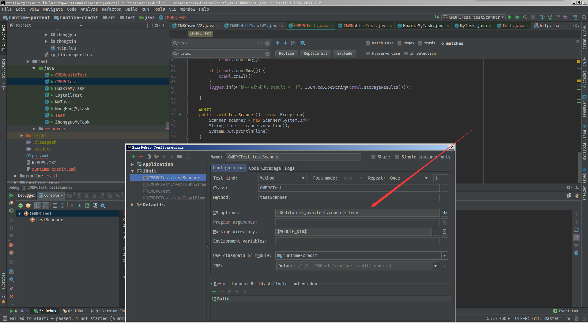

# Módulo 1 - Sesión 6 "Operaciones de Infraestructura como código (Ansible, Terraform y Packer)" PostWork

Ejercicio 1.
Carpeta gsilvav-myAPI-microservicio-a

El siguiente repositorio tiene como propósito ejecutar un microservicio en Docker a través de la implementación con Terraform.

Ejercicio 2.
Carpeta gsilvav-myAPI-iac

El siguiente repositorio tiene como propósito implementar recursos en Microsoft Azure con Terraform.

Documentación Terraform Azure Provider:

<https://registry.terraform.io/providers/hashicorp/azurerm/latest/docs>

Los recursos a crear

-   Creación de una red virtual
-   Creación de una subred
-   Crear una dirección IP pública
-   Creación de un grupo de seguridad de red y una regla de entrada SSH
-   Creación de una tarjeta de interfaz de red virtual
-   Conexión del grupo de seguridad de red a la interfaz de red
-   Creación de una cuenta de almacenamiento para el diagnóstico de arranque
-   Creación de una clave SSH
-   Creación de una máquina virtual

**Crear los archivos de configuración.**

En el directorio gsilvav-myAPI-iac se encuentran los archivos de configuración de Terrafom:

Crear los siguientes archivos:

providers.tf.

main.tf

variables.tf

Conectarse a su cuenta con Azure CLI:

az login

**Inicialización de Terraform**

Para inicializar la implementación de Terraform, ejecute:

terraform init

**Crear el plan de ejecución que permite obtener una vista previa de los cambios de infraestructura antes de implementarlos.**

terraform plan -out main.tfplan

terraform plan crea un plan de ejecución, pero no lo ejecuta. En su lugar, determina qué acciones son necesarias para crear la configuración especificada en los archivos de configuración.

**Comprobados los cambios, aplicar el plan de ejecución para implementar la infraestructura.**

terraform apply main.tfplan

Resultado en Microsoft Azure:

