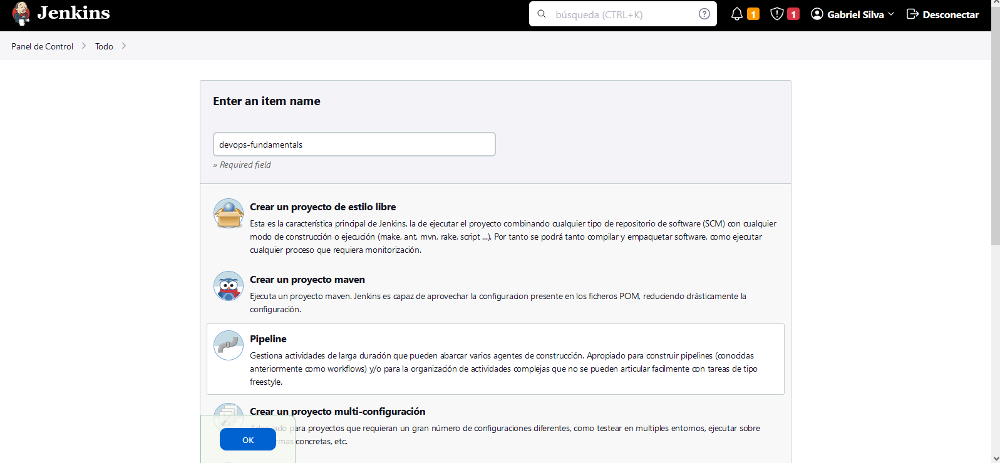
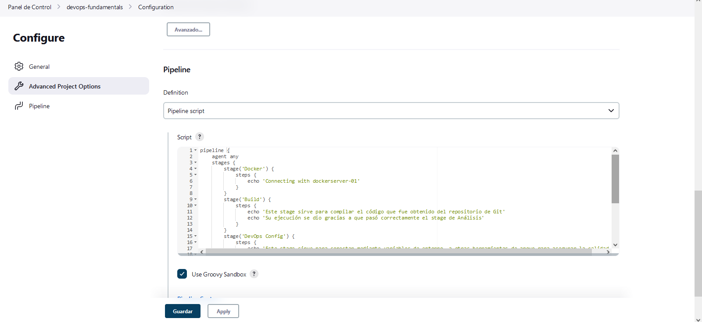
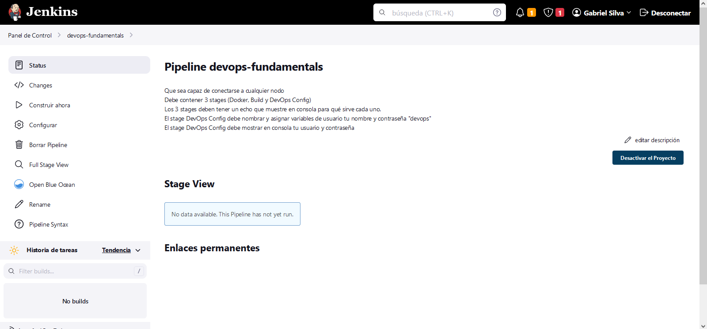
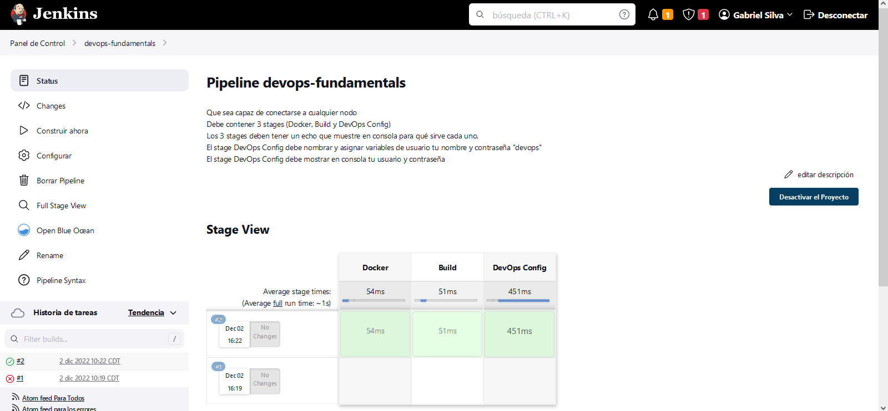
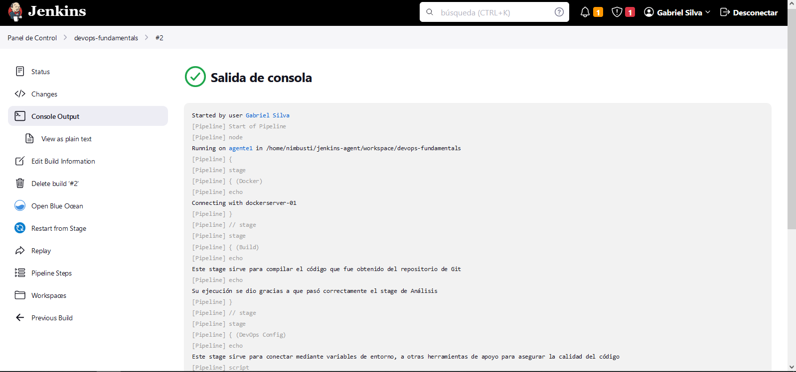

## Reto 1 - Crea tu propio código Groovy

Se crea un pipeline llamado "devops-fundamentals"

-   Que sea capaz de conectarse a cualquier nodo
-   Debe contener 3 stages (Docker, Build y DevOps Config)
-   Los 3 stages deben tener un echo que muestre en consola para qué sirve cada uno.
-   El stage DevOps Config debe nombrar y asignar variables de usuario tu nombre y contraseña "devops"
-   El stage DevOps Config debe mostrar en consola tu usuario y contraseña

