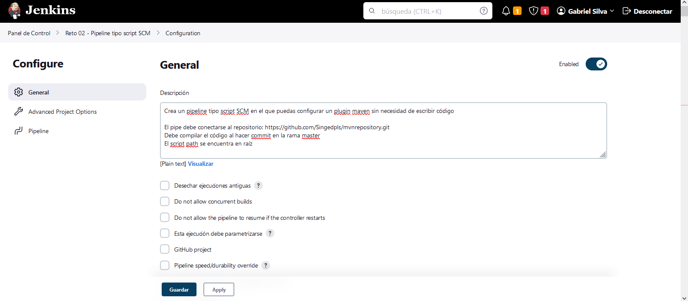
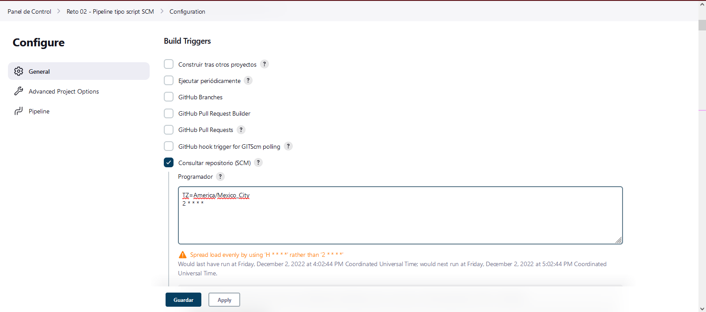
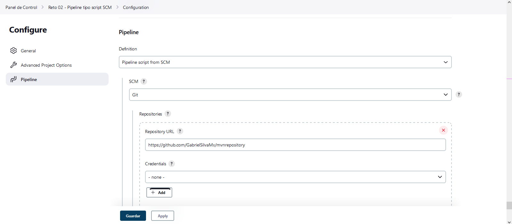
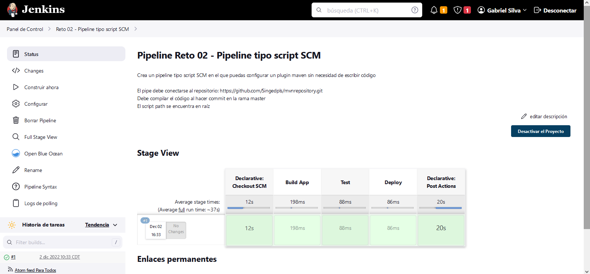
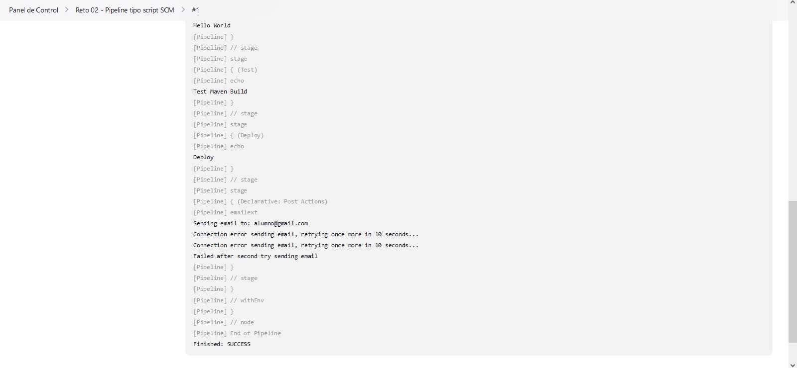
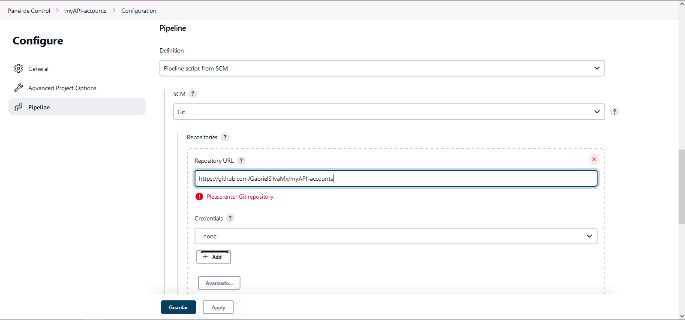

## Reto 02 - Compila código de GitHub

Crea un pipeline tipo script SCM en el que puedas configurar un plugin maven sin necesidad de escribir código

-   El pipe debe conectarse al repositorio: <https://github.com/Singedpls/mvnrepository.git>
-   Debe compilar el código al hacer commit en la rama master
-   El script path se encuentra en raíz

