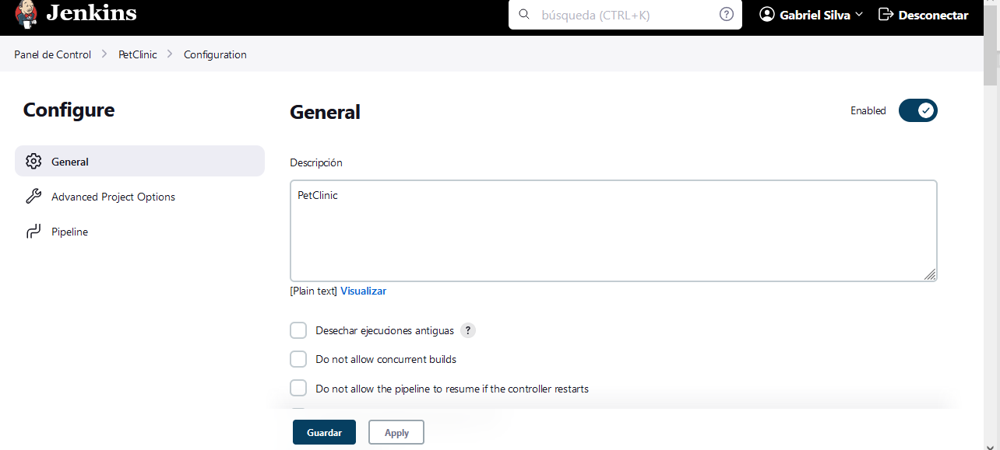
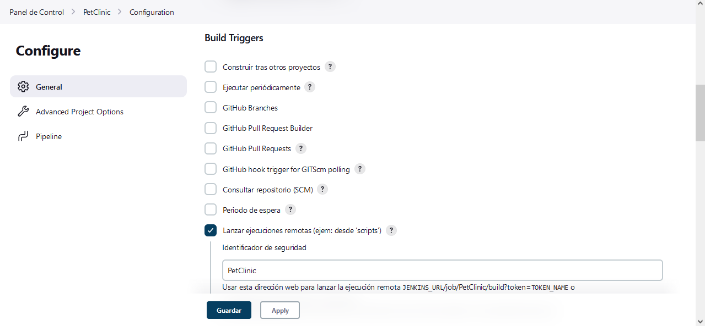
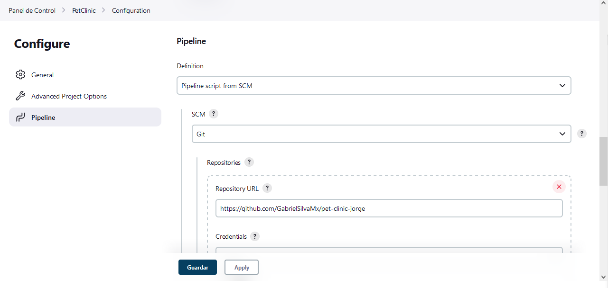
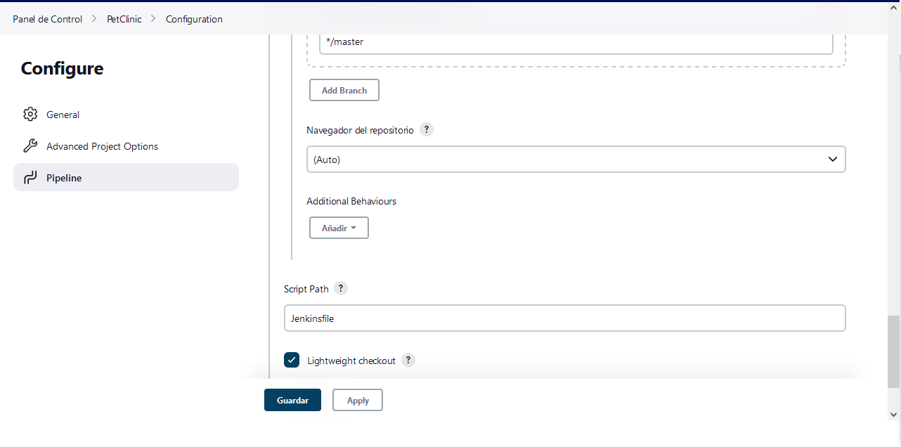
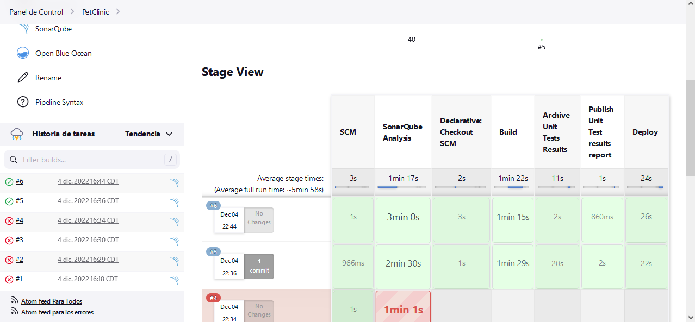
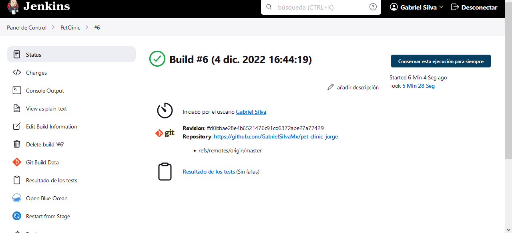
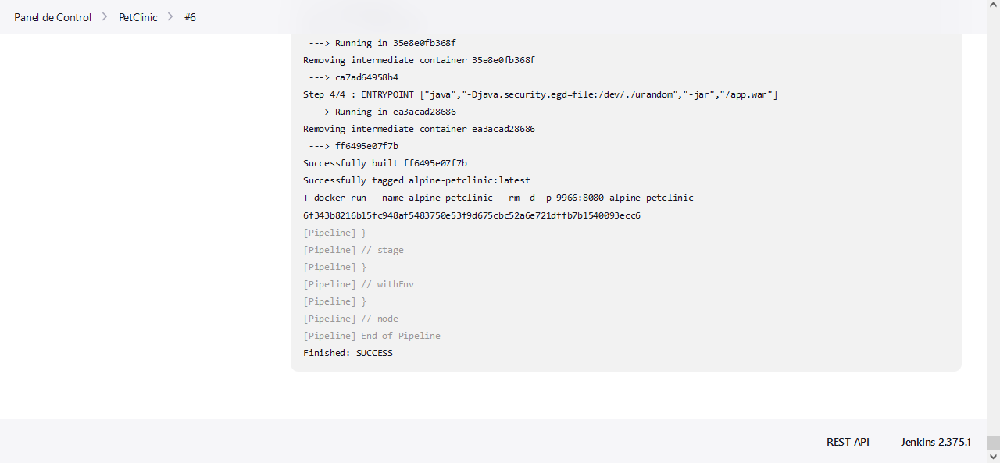
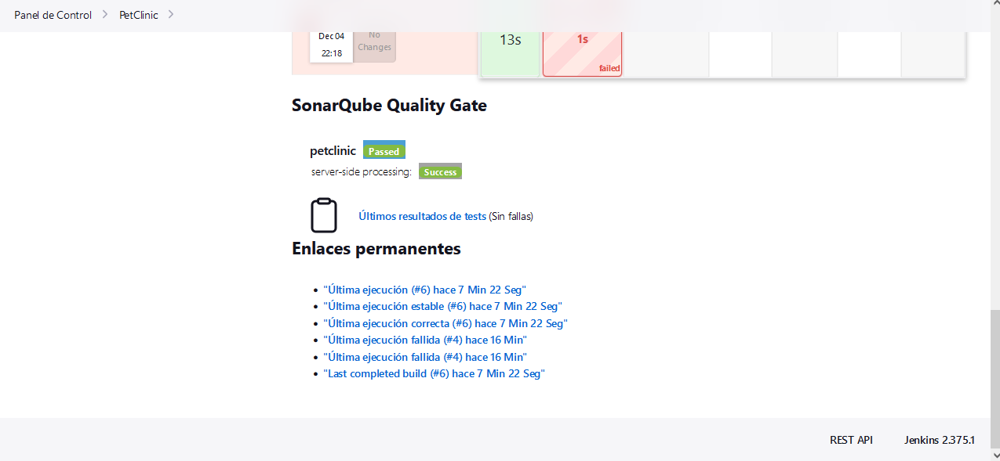
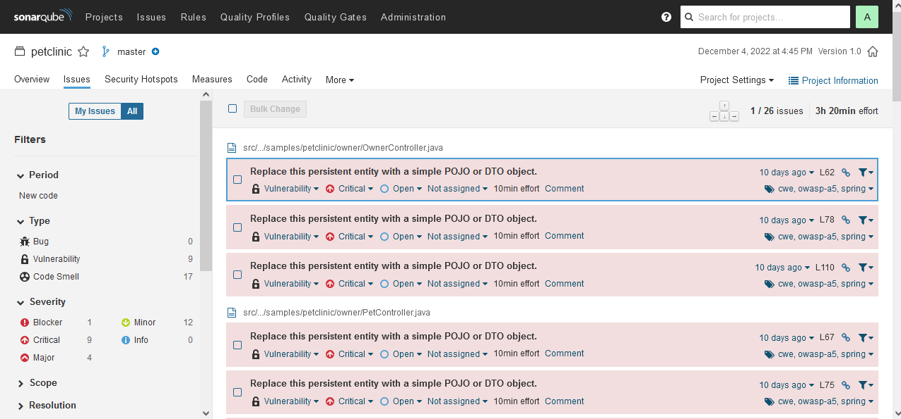
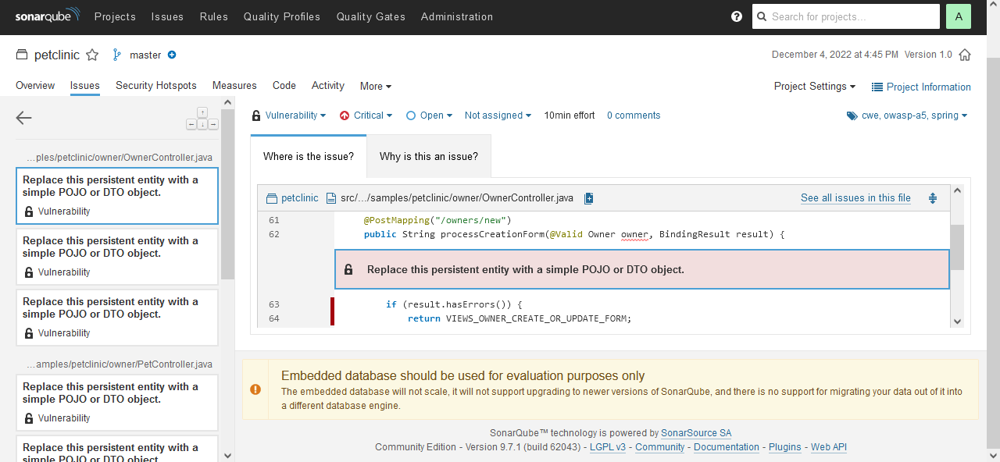

## Sesión 8 CI/CD con Jenkins / testing

## Proyecto PetClinic 

- Configurar Pipelines de CI/CD con Jenkins
- Configuración de herramientas de Test y Seguridad
- Conectar el SonarQube con Jenkins.
- Pruebas de código dinámico

